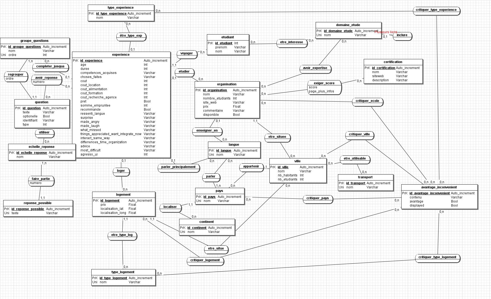

# Web Application for the Collection and Exploration of Students Feedback on International Experiences
  Project developed as part of a course to practice web development, database design, and event-driven programming with Node.js.
  

## Usage
  1. Clone this repos
  2. Execute `sudo ./startApp.sh` to build Docker images and launch the webapp in docker instances
  3. Browse to http://localhost
